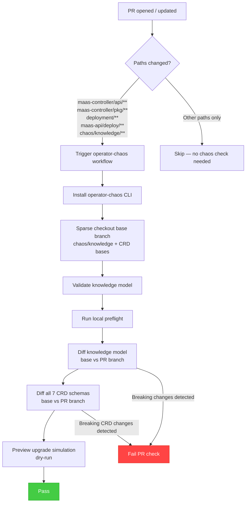
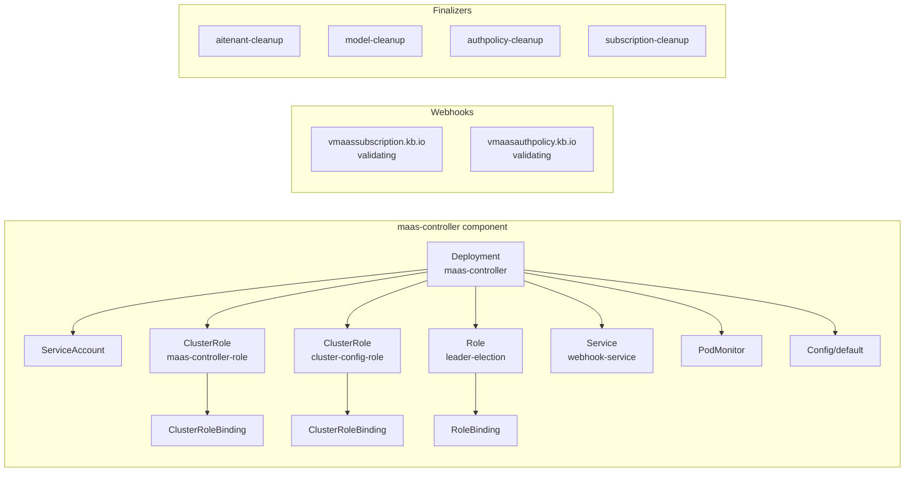

# Operator Chaos — Shift-Left Upgrade Validation

This directory contains the [operator-chaos](https://github.com/opendatahub-io/operator-chaos) knowledge model for the MaaS controller. It enables automated detection of upgrade-breaking changes at PR time, before code is merged.

## What is operator-chaos?

operator-chaos is a Go-based chaos engineering and upgrade validation tool maintained by the OpenDataHub community. It provides:

- **Knowledge models** — declarative YAML describing an operator's topology (managed resources, webhooks, finalizers, steady-state checks)
- **Breaking change detection** — diffs knowledge models and CRD schemas between PR and base branch to flag regressions
- **Upgrade simulation** — previews what upgrade experiments would run (dry-run, no cluster required)

## Maturity levels adopted

This integration targets **L1–L2**:

| Level | What it covers | Status |
|-------|---------------|--------|
| L1 | GitHub Actions workflow validates knowledge model and CRDs on every PR | Active |
| L2 | Knowledge model contributed to upstream operator-chaos profiles | Active |
| L3 | ChaosClient SDK integrated into controller tests | Future |
| L4 | Upgrade playbook YAML contributed | Future |

## How the CI workflow works



## What the knowledge model describes

The knowledge model (`maas.yaml`) declares the MaaS operator's expected topology:



## Relationship to upstream profiles

This repo maintains a local knowledge model for CI validation. The upstream
`operator-chaos` repo maintains platform-specific copies under its profile
directories:

```
operator-chaos/profiles/
├── odh/
│   ├── profile.yaml                  # namespace: opendatahub
│   └── knowledge/
│       └── maas.yaml                 # ODH variant
├── rhoai/
│   ├── profile.yaml                  # namespace: redhat-ods-applications
│   └── knowledge/
│       └── maas.yaml                 # RHOAI variant
```

The local file (`chaos/knowledge/maas.yaml`) uses the base namespace
(`opendatahub`) and is used exclusively for offline CI checks where the
namespace value does not affect validation outcomes.

## CRDs validated

The workflow diffs all MaaS CRDs between the base and PR branches:

| CRD | File |
|-----|------|
| AITenant | `deployment/base/maas-controller/crd/bases/maas.opendatahub.io_aitenants.yaml` |
| Config | `deployment/base/maas-controller/crd/bases/maas.opendatahub.io_configs.yaml` |
| ExternalModel | `deployment/base/maas-controller/crd/bases/maas.opendatahub.io_externalmodels.yaml` |
| MaaSAuthPolicy | `deployment/base/maas-controller/crd/bases/maas.opendatahub.io_maasauthpolicies.yaml` |
| MaaSModelRef | `deployment/base/maas-controller/crd/bases/maas.opendatahub.io_maasmodelrefs.yaml` |
| MaaSSubscription | `deployment/base/maas-controller/crd/bases/maas.opendatahub.io_maassubscriptions.yaml` |
| Tenant | `deployment/base/maas-controller/crd/bases/maas.opendatahub.io_tenants.yaml` |

## Running locally

```bash
# from the repo root — install operator-chaos and validate
make -C maas-controller chaos-validate

# or manually:
operator-chaos validate --knowledge chaos/knowledge/maas.yaml
operator-chaos preflight --knowledge chaos/knowledge/maas.yaml --local
```

## Maintaining the knowledge model

Update `chaos/knowledge/maas.yaml` whenever:

- A new managed resource is added or removed from a controller
- CRD types are added, renamed, or removed
- Webhooks are added or changed
- Finalizers are added or removed
- The operator Deployment spec changes (name, labels, replicas)
- RBAC resources are added or restructured

Also update the upstream profiles in the `operator-chaos` repo when making
these changes.
