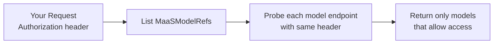

# Model Access Control

This page explains how the MaaS platform determines which models a user can access. For practical guides, see:

- [Model Discovery](../user-guide/model-discovery.md) - Listing available models
- [Inference](../user-guide/inference.md) - Making inference requests
- [Quota and Access Configuration](../configuration-and-management/quota-and-access-configuration.md) - For administrators

---

## Overview

Access to models in MaaS requires both **permission** (MaaSAuthPolicy) and **quota** (MaaSSubscription):

- **MaaSAuthPolicy** defines which groups can access which models
- **MaaSSubscription** defines token rate limits and model availability for owner groups
- **API keys** bind to one subscription at creation and inherit group membership

A user must match both a MaaSAuthPolicy and a MaaSSubscription to access a model.

---

## Model Discovery Implementation

The `/v1/models` endpoint allows you to discover which models you're authorized to access. The API forwards the same `Authorization` header you send to each model route, so the result depends on what those model routes accept.

### How It Works

When you call **GET /v1/models** with an **Authorization** header, the API passes that header **as-is** to each model's `/v1/models` endpoint to validate access. Only models that return 2xx or 405 are included in the list. No token exchange or modification is performed; the same header you send is used for the probe.

This means you can:

1. **Use an API key** — this is the most portable option because the current model-route AuthPolicies already validate `sk-oai-*` keys.
2. **Use an identity token directly** — only when the model routes themselves accept that token type.
3. **Create a key first for the interim OIDC flow** — when OIDC is enabled only on the `maas-api` route, use your OIDC token to call `POST /v1/api-keys`, then call `/v1/models` with the minted API key.

!!! note "Inference vs listing"
    Inference (calls to each model's chat/completions URL) requires an API key in `Authorization: Bearer` only. Do not send `X-MaaS-Subscription` on inference—the subscription is the one bound at API key mint time. `GET /v1/models` accepts either an API key or an OpenShift token; with a user token, `X-MaaS-Subscription` remains supported for filtering.

### Interim OIDC Flow

When the `maas-api` AuthPolicy is configured for OIDC but model HTTPRoutes still use the existing API-key-only policy, the flow is:

1. Authenticate to your IdP and obtain an OIDC access token.
2. Call `POST /v1/api-keys` with that OIDC token.
3. Use the returned `sk-oai-*` key for `GET /v1/models` and inference requests.

This preserves compatibility with the current model-route policy while allowing non-OpenShift identities to onboard through `maas-api`.

---

## AuthPolicy and Subscription Interaction

### MaaSAuthPolicy

MaaSAuthPolicy resources grant **permission** to access models. Each policy:

- Lives in the `models-as-a-service` namespace
- References one or more MaaSModelRef resources (by name and namespace)
- Specifies which groups or users can access those models
- Generates Authorino AuthPolicy resources for enforcement at the gateway

**Multiple policies per model**: You can create multiple MaaSAuthPolicies that reference the same model. The controller aggregates them—a user matching any policy gets access.

### MaaSSubscription

MaaSSubscription resources grant **quota** and define rate limits. Each subscription:

- Lives in the `models-as-a-service` namespace
- References one or more MaaSModelRef resources (by name and namespace)
- Specifies owner groups or users
- Defines per-model token rate limits (e.g., 100 tokens/min, 100000 tokens/24h)
- Has a priority for automatic selection

**API key binding**: When you create an API key, it binds to one subscription (explicit or highest priority). The bound subscription determines which models you can access and what rate limits apply.

### Access Decision Flow

For a user to access a model:

1. **Authentication**: User presents an API key or identity token
2. **Authorization check** (AuthPolicy):
   - Does the user's groups match any MaaSAuthPolicy for this model?
   - If no: 403 Forbidden
3. **Quota check** (Subscription):
   - Does the user's API key have a subscription that includes this model?
   - If no: 403 Forbidden
4. **Rate limit check** (TokenRateLimitPolicy):
   - Has the user exceeded token limits for this subscription?
   - If yes: 429 Too Many Requests
5. **If all checks pass**: Request forwarded to model backend

---

## Related Documentation

**User Guides:**

- [Model Discovery](../user-guide/model-discovery.md) - Listing available models
- [Inference](../user-guide/inference.md) - Making inference requests
- [API Key Management](../user-guide/api-key-management.md) - Creating and managing API keys

**Concepts:**

- [API Key Authentication](api-key-authentication.md) - How API key creation and validation works
- [Access and Quota Overview](subscription-overview.md) - High-level overview of policies and subscriptions

**Administration:**

- [Quota and Access Configuration](../configuration-and-management/quota-and-access-configuration.md) - Configuring MaaSAuthPolicy and MaaSSubscription
